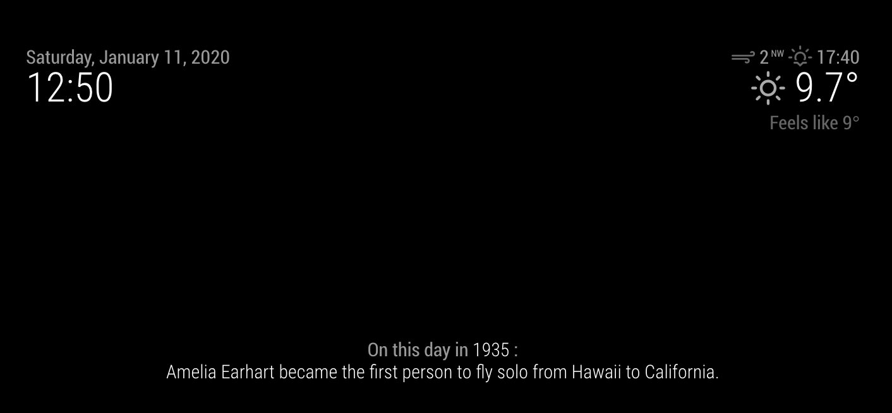

# MagicMirror² Module: On-This-Day

`on-this-day` is a module for [MagicMirror²](https://magicmirror.builders/) that displays a random fact of something that happened on this day in history.



This module is based on a personal API that is yet to be published.
The facts are only available in English but are translated according to the language preference of your Magic Mirror.
The fact is updated everyday at midnight.


## Installation:

Go to your MagicMirror's Module folder in your terminal:
````
cd ~/MagicMirror/modules
````

Clone this repository:
````
git clone https://github.com/elliefairholm/on-this-day.git
````

Go to the modules folder:
````
cd on-this-day
````

Install the dependencies:
````
npm install
````

Add the module to the modules array in the `config/config.js` file by adding the following section. You can change this configuration later when you see this works:
```
{
    module: 'on-this-day',
    position: 'bottom_bar',
    config: {
                // see below for configurable options...
            }
},
```

## Configuration options:

| Option                       | Description
| ---------------------------- | -----------
| `updateInterval`                   | How often the fact will be updated during the day. It is automatically updated everyday at 00:00. But if you wish for the fact to be updated more often, add your own timeframe in milliseconds (1000 = 1 second). <br><br> **Example:** `1000 * 60` = will be updated every minute. <br> **Default value:** `undefined`
| `animationSpeed`                 | The speed of the update animation in milliseconds. <br><br> **Example:**`500` = half a second <br> **Default value:** `1000` = 1 second
| `interests`                      | An array of interests you may have to curate the facts you will receive. <br><br> **Possible values:** `"history"`, `"film-tv"`, `"sports"` <br> **Default value:** `general`

I hope you enjoy the module and learn something new everyday!